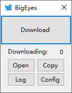

# bigEyes-twitter
An winform app for downloading origin images on X (Twitter).
推特原图助手

## Usage
1. Find one tweet that contains image
2. Copy the url of the image (looks like `https://pbs.twimg.com/media/FCRriGrUcAUA7OG?format=jpg&name=900x900`, **instead of the url contained in the image which looks like `https://twitter.com/usembassytokyo/status/1451403238318612480/photo/1`**)
3. Goto BigEyes.exe, and click downlaod.
4. Find the image in your saving path, which by default is your desktop.

## More Screenshots

## Lisense
License
This repository is under MIT License.
The icon image of this executive file is consisted by a blue bird and an eye. The blue bird was a trademark of [X](https://x.com) and the eye is an emoji of (Twemoji)[https://github.com/twitter/twemoji].
